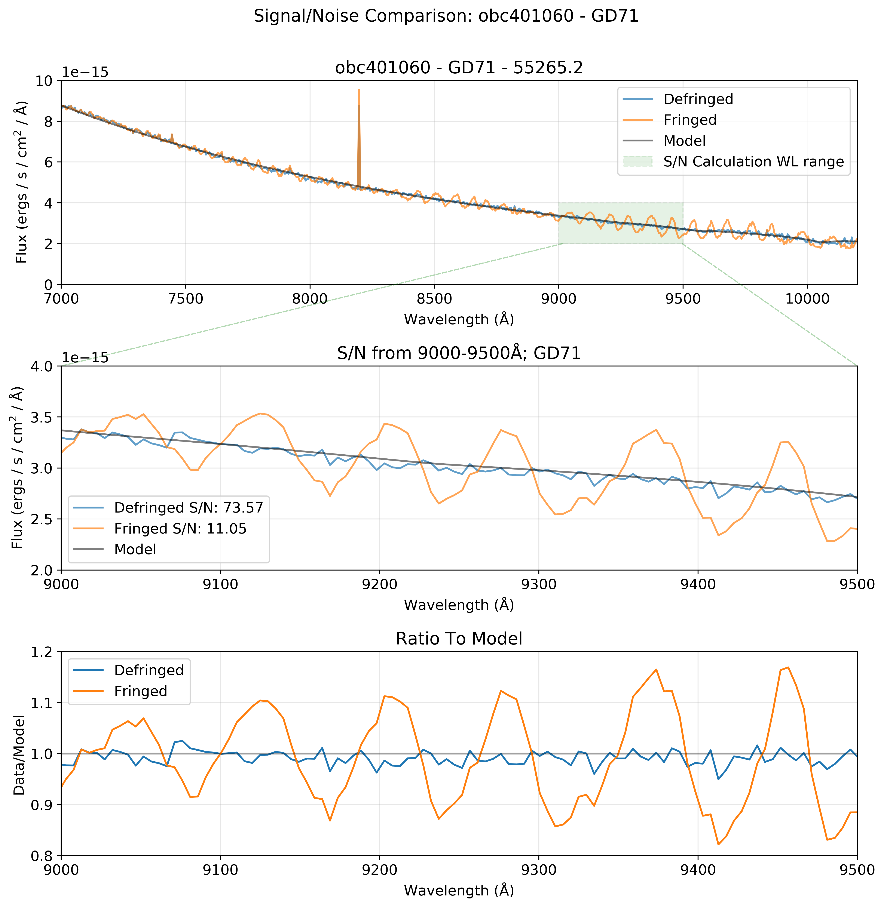

.. _defringe:

**************************
defringe
**************************

.. contents::
   :local:
   :depth: 0

**Guides & Examples:**

.. toctree::
   :maxdepth: 2

   Defringe User Guide <defringe_guide.rst>
   Defringe Examples <defringe_examples.rst>

---------------------------------------------------
Table of File Inputs/Outputs for the Defringe Tools
---------------------------------------------------

+--------------+--------------------------------------+--------------------------------+
|    Tool      |            Input(s)                  |       Output(s)                |
+==============+======================================+================================+
| normspflat   | | **If do_cal is True:**             | | [flat_file]_nsp.fits         |
|              | | [flat_file]_raw.fits,              |                                |
|              | | [sci_file]_wav.fits                |                                |
|              | |                                    |                                |
|              | | **If do_cal is False:**            |                                |
|              | | [flat_file]_crj.fits (G750L)       |                                |
|              | | or [flat_file]_sx2.fits (G750M)    |                                |
|              | | [sci_file]_wav.fits                |                                |
+--------------+--------------------------------------+--------------------------------+
|  prepspec    | | [sci_file]_raw.fits                | | **Standard Calstis Outputs:**|
|              |                                      | | [sci_file]_flt.fits          |
|              |                                      | | [sci_file]_crj.fits          |
|              |                                      | | [sci_file]_sx1.fits          |
|              |                                      | | [sci_file]_sx2.fits          |
+--------------+--------------------------------------+--------------------------------+
| mkfringeflat | | [flat_file]_nsp.fits               | | [flat_file]_frr.fits         |
|              | | [sci_file]_crj.fits (G750L) or     |                                |
|              | | [sci_file]_sx2.fits (G750M)        |                                |
+--------------+--------------------------------------+--------------------------------+
| defringe     | | [flat_file]_frr.fits               | | [sci_file]_drj.fits (G750L)  |
|              | | [sci_file]_crj.fits (for G750L)    | | or                           |
|              | | or [sci_file]_sx2.fits (for G750M) | | [sci_file]_s2d.fits (G750M)  |
+--------------+--------------------------------------+--------------------------------+

-----------------------------------------
Effectiveness of the Defringing Tools
-----------------------------------------

The defringing process has the potential to significantly increase the 
signal-to-noise ratio of an observation. By removing fringes in an 
observation of a standard white dwarf target with a well characterized 
model, we measured an increase in the signal-to-noise ratio from 11 to 
73 in the 9000-9500Å wavelength range. 

Depending on wavelength range, target, and other observational parameters, 
we expect that the presence of fringes in an observation may reduce 
signal-to-noise by up to a factor of 7x. By removing these fringes, we 
improve the signal-to-noise ratio accordingly.

We calculate the signal-to-noise as 1 divided by the standard deviation of 
the ratio of the data to the model for a given wavelength range.

------------
Routines
------------

.. currentmodule:: stistools.defringe
.. automodule:: stistools.defringe
  :ignore-module-all:

prepspec
^^^^^^^^

.. autofunction:: stistools.defringe.prepspec

normspflat
^^^^^^^^^^

.. autofunction:: stistools.defringe.normspflat

mkfringeflat
^^^^^^^^^^^^

.. autofunction:: stistools.defringe.mkfringeflat

defringe
^^^^^^^^

.. autofunction:: stistools.defringe.defringe
