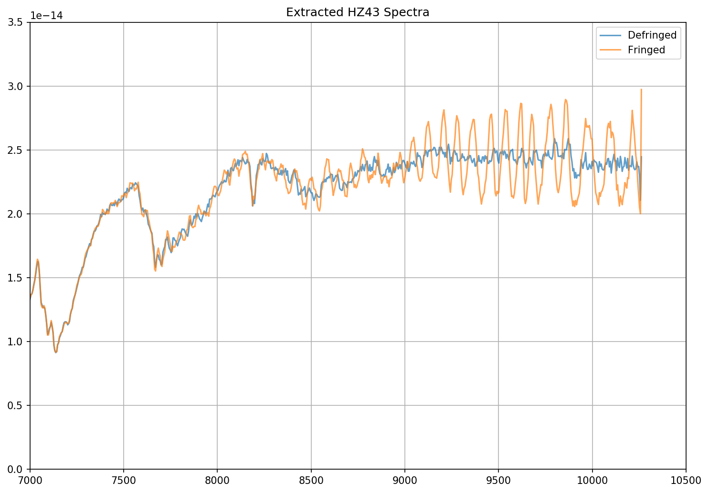
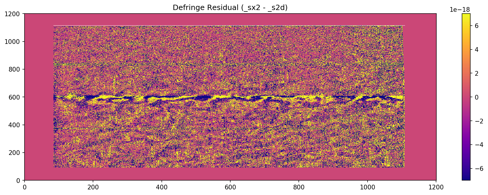

.. code:: ipython3

    %matplotlib inline

    import stistools
    from astropy.io import fits
    import matplotlib.pyplot as plt
    import numpy as np
    import glob
    import matplotlib

.. code:: ipython3

    matplotlib.rcParams['image.origin'] = 'lower'
    matplotlib.rcParams['image.aspect'] = 'auto'
    matplotlib.rcParams['image.cmap'] = 'plasma'
    matplotlib.rcParams['image.interpolation'] = 'none'
    matplotlib.rcParams['figure.figsize'] = [15, 5]

STIS CCD Defringing Examples
============================

The Stistools defringing tools
(``normspflat``,\ ``prepspec``,\ ``mkfringeflat``, and ``defringe``) are
needed to correct the fringing patterns that are present in the reddest
STIS observing modes (>7000\ :math:`\mathring A`), namely G750M and
G750L. The Defringing Guide provides a step-by-step tutorial on how to
use these tools to perform this correction. The following serves to show
several practical examples of it’s use on STIS data.

G750L Observation of HZ43
~~~~~~~~~~~~~~~~~~~~~~~~~

.. code:: ipython3

    # Set up the data paths

    sci_file = 'o49x18010'
    flat_file = 'o49x18020'

    # Normalize the contemoraneous flat field image
    stistools.defringe.normspflat(f"{flat_file}_raw.fits",
                                  f"{flat_file}_nsp.fits", do_cal=True,
                                  wavecal=f"{sci_file}_wav.fits")

.. parsed-literal::

    File written:  /Users/stisuser/data/path/o49x18020_crj.fits

.. code:: ipython3

    # make the fringe flat, using the crj file for the science because this is G750L
    stistools.defringe.mkfringeflat(f"{sci_file}_crj.fits", f"{flat_file}_nsp.fits",
                                   f"{flat_file}_frr.fits")

.. parsed-literal::

    mkfringeflat.py version 0.1
     - matching fringes in a flatfield to those in science data
     Extraction center: row 511
       Extraction size: 11.0 pixels  [Aperture: 52X2]
    Range to be normalized: [506:517,4:1020]

    Determining best shift for fringe flat

    shift = -0.5, rms = 0.02521565587012733
    shift = -0.4, rms = 0.02374587534351394
    shift = -0.3, rms = 0.022735165926832522
    shift = -0.19999999999999996, rms = 0.022235801562053452
    shift = -0.09999999999999998, rms = 0.0223095350312966
    shift = 0.0, rms = 0.022870072599462554
    shift = 0.10000000000000009, rms = 0.023099186545412927
    shift = 0.20000000000000007, rms = 0.0238499817578987
    shift = 0.30000000000000004, rms = 0.025041375073110203
    shift = 0.4, rms = 0.026649802114317847
    shift = 0.5, rms = 0.02860146728021774

     Best shift : -0.1963593679893798 pixels
     Shifted flat : o49x18020_nsp_sh.fits
                    (Can be used as input flat for next iteration)

    Determining best scaling of amplitude of fringes in flat

    Fringes scaled  0.8: RMS = 0.022225777873537036
    Fringes scaled  0.8400000000000001: RMS = 0.021245650237594484
    Fringes scaled  0.88: RMS = 0.02073729355208867
    Fringes scaled  0.92: RMS = 0.02073643145196044
    Fringes scaled  0.9600000000000001: RMS = 0.021244380189719227
    Fringes scaled  1.0: RMS = 0.022227696178223795
    Fringes scaled  1.04: RMS = 0.023664059746596907
    Fringes scaled  1.08: RMS = 0.025413279490181823
    Fringes scaled  1.12: RMS = 0.02744748231768354
    Fringes scaled  1.1600000000000001: RMS = 0.029710009708226032
    Fringes scaled  1.2000000000000002: RMS = 0.03215458872298658

     Best scale : 0.9182259885801685
    Output flat : o49x18020_frr.fits
      (to be used as input to task 'defringe.py')

.. code:: ipython3

    # Defringe the science spectrum
    stistools.defringe.defringe(f"{sci_file}_crj.fits", f"{flat_file}_frr.fits", overwrite=True)

.. parsed-literal::

    Fringe flat data were read from the primary HDU
    Imset 1 done
    Defringed science saved to o49x18010_drj.fits

.. parsed-literal::

    'o49x18010_drj.fits'

.. code:: ipython3

    # Now, extract the spectra from both the fringed (crj) and defringed (drj) data
    defringed = glob.glob(f"{sci_file}*drj.fits")
    fringed = glob.glob(f"{sci_file}*crj.fits")
    files = [defringed[0], fringed[0]]

    outnames = [f'{defringed[0].split("/")[-1].split("_")[0]}_dx1d.fits', f'{fringed[0].split("/")[-1].split("_")[0]}_x1d.fits']

    for i in range(len(outnames)):
        stistools.x1d.x1d(files[i], output=outnames[i])

.. code:: ipython3

    dx1d = fits.open(outnames[0])
    x1d = fits.open(outnames[1])

    # Plot both the fringed and the defringed 1D extracted spectra together
    fig = plt.figure(figsize=(10,7),dpi=150)
    plt.plot(dx1d[1].data['WAVELENGTH'][0], dx1d[1].data['FLUX'][0],'-', label='Defringed', alpha=0.7)
    plt.plot(x1d[1].data['WAVELENGTH'][0], x1d[1].data['FLUX'][0],'-', label='Fringed', alpha=0.7)

    plt.xlim(7000,10500)
    plt.ylim(0, 3.5e-14)
    plt.title("Extracted HZ43 Spectra")
    plt.grid()
    plt.legend()
    plt.tight_layout()

G750M Observation of AGK+81D266
~~~~~~~~~~~~~~~~~~~~~~~~~~~~~~~

.. code:: ipython3

    #setup data paths

    sci_file = "oe36m10g0"
    flat_file = "oe36m10j0"

    # Normalize the contemporaneous flat field image
    stistools.defringe.normspflat(f"{flat_file}_raw.fits",
                                  f"{flat_file}_nsp.fits", do_cal=True,
                                  wavecal=f"{sci_file}_wav.fits")

.. parsed-literal::

    File written:  /Users/stisuser/data/path/oe36m10j0_sx2.fits

.. parsed-literal::

    /Users/stisuser/install/path/normspflat.py:216: RuntimeWarning: divide by zero encountered in true_divide
      row_fit = fit_data/spl(xrange)
    /Users/stisuser/install/path/normspflat.py:216: RuntimeWarning: invalid value encountered in true_divide
      row_fit = fit_data/spl(xrange)

.. code:: ipython3

    # make the fringe flat, using the sx2 file for the science because this is G750M
    stistools.defringe.mkfringeflat(f"{sci_file}_sx2.fits", f"{flat_file}_nsp.fits",
                                    f"{flat_file}_frr.fits", beg_shift=-1.0, end_shift=0.5, shift_step=0.1,
                                    beg_scale=0.8, end_scale=1.5, scale_step=0.04)

.. parsed-literal::

    mkfringeflat.py version 0.1
     - matching fringes in a flatfield to those in science data
     Extraction center: row 602
       Extraction size: 11.0 pixels  [Aperture: 52X2]
    Range to be normalized: [597:608,83:1106]

    Determining best shift for fringe flat

    shift = -1.0, rms = 0.06751209969416246
    shift = -0.9, rms = 0.06750664734039523
    shift = -0.8, rms = 0.06750325556538965
    shift = -0.7, rms = 0.06750192457752245
    shift = -0.6, rms = 0.06750265937240976
    shift = -0.5, rms = 0.06750545682621624
    shift = -0.3999999999999999, rms = 0.06750588470469428
    shift = -0.29999999999999993, rms = 0.06751357970780972
    shift = -0.19999999999999996, rms = 0.06752336035281563
    shift = -0.09999999999999998, rms = 0.06753522897336409
    shift = 0.0, rms = 0.06754918994601025
    shift = 0.10000000000000009, rms = 0.06754304260847464
    shift = 0.20000000000000018, rms = 0.0675389748466461
    shift = 0.30000000000000004, rms = 0.06753698522431144
    shift = 0.40000000000000013, rms = 0.06753708053436966
    shift = 0.5, rms = 0.06753925625176614

     Best shift : -0.6999982359381194 pixels
     Shifted flat : oe36m10j0_nsp_sh.fits
                    (Can be used as input flat for next iteration)

    Determining best scaling of amplitude of fringes in flat

    Fringes scaled  0.8: RMS = 0.06762238400706264
    Fringes scaled  0.8400000000000001: RMS = 0.06759376871355414
    Fringes scaled  0.88: RMS = 0.06756741543477168
    Fringes scaled  0.92: RMS = 0.0675433153759303
    Fringes scaled  0.9600000000000001: RMS = 0.06752149090813866
    Fringes scaled  1.0: RMS = 0.06750192634866954
    Fringes scaled  1.04: RMS = 0.067484628741123
    Fringes scaled  1.08: RMS = 0.06746960905640136
    Fringes scaled  1.12: RMS = 0.06745685643406156
    Fringes scaled  1.1600000000000001: RMS = 0.06744637965688902
    Fringes scaled  1.2000000000000002: RMS = 0.06743817834085863
    Fringes scaled  1.24: RMS = 0.06743225706483276
    Fringes scaled  1.28: RMS = 0.06742860539788004
    Fringes scaled  1.32: RMS = 0.06742723706558065
    Fringes scaled  1.36: RMS = 0.06742814340085584
    Fringes scaled  1.4: RMS = 0.06743132876996823
    Fringes scaled  1.44: RMS = 0.06743679508124968
    Fringes scaled  1.48: RMS = 0.06744453855109715
    Fringes scaled  1.52: RMS = 0.06745456004413491

     Best scale : 1.3200005501263359
    Output flat : oe36m10j0_frr.fits
      (to be used as input to task 'defringe.py')

.. code:: ipython3

    # defringe the science spectrum
    stistools.defringe.defringe(f"{sci_file}_sx2.fits", f"{flat_file}_frr.fits", overwrite=True)

.. parsed-literal::

    Fringe flat data were read from the primary HDU
    19 pixels in the fringe flat were less than or equal to 0
    Imset 1 done
    Defringed science saved to oe36m10g0_s2d.fits

.. parsed-literal::

    /Users/stisuser/install/path/defringe.py:95: RuntimeWarning: invalid value encountered in less_equal
      fringe_mask = (fringe_data <= 0.)

.. parsed-literal::

    'oe36m10g0_s2d.fits'

.. code:: ipython3

    # Plot the fringe pattern removed from the sx2 file

    scale = 7*10**-18
    resid = fits.getdata(f"{sci_file}_sx2.fits")-fits.getdata(f"{sci_file}_s2d.fits")

    fig = plt.figure(dpi=150)
    plt.imshow(resid,vmin=-scale, vmax=scale)
    plt.title("Defringe Residual (_sx2 - _s2d)")

    cbar = plt.colorbar()

Subarray Data
~~~~~~~~~~~~~~

If the science data is subarray data, there are a few extra steps in the process before defringing.

.. code:: ipython3

    # Set up the data paths
    sci_file = 'odqf11trq'
    flat_file = 'odqf11060'

.. code:: ipython3

    # Normalize the contemporaneous flat field image
    stistools.defringe.normspflat(f"{flat_file}_raw.fits",
                                  f"{flat_file}_nsp.fits", do_cal=True,
                                  wavecal=f"{sci_file}_wav.fits")

.. parsed-literal::

    File written:  /Users/stisuser/data/path/odqf11060_crj.fits

If using G750L data, set the order sorter fringes in the flat field equal to one. This particular dataset is G750L data.

.. code:: ipython3

    with fits.open(f"{flat_file}_nsp.fits", mode="update") as flat_hdu:
      flat_data = flat_hdu[1].data
      flat_data[:, :250] = 1

Next, pad the subarray data with zeros so that it is the same size as the flat field data

.. code:: ipython3

    sci = fits.open(f"{sci_file}_crj.fits")
    sci_data = sci[1].data
    flat_data = fits.getdata(f"{flat_file}_nsp.fits")

    ymin_sci = sci[0].header['CENTERA2'] - (sci[0].header['SIZAXIS2']/2.)
    ymax_sci = sci[0].header['CENTERA2'] + (sci[0].header['SIZAXIS2']/2.)

    full_sci = np.zeros(np.shape(flat_data), dtype='float32')
    full_sci = [int(ymin_sci):int(ymax_sci), :] = sci_data
    full_dq = np.zeros(np.shape(flat_data), dtype='int16')
    full_dq[int(ymin_sci):int(ymax_sci), :] = sci_dq
    full_err = np.zeros(np.shape(flat_data), dtype='float32')
    full_err[int(ymin_sci):int(ymax_sci), :] = sci_err

Put the full frame data into a new file and populate the headers

.. code:: ipython3

    header1 = sci[0].header
    sci_header = sci['SCI'].header
    err_header = sci['ERR'].header
    dq_header = sci['DQ'].header

    # Create the new fits file
    empty_primary = fits.PrimaryHDU(header=header1)
    image_hdu = fits.ImageHDU(full_sci, name='SCI', header=sci_header)
    err_hdu = fits.ImageHDU(full_err, name='ERR', header=err_header)
    dq_hdu = fits.ImageHDU(full_dq, name='DQ', header=dq_header)
    hdu = fits.HDUList([empty_primary, image_hdu, err_hdu, dq_hdu])

    fullframe_output = f"{sci_file}_fullfield_crj.fits"
    hdu.writeto(fullframe_output)

Finally, change the LTV2 header keyword to zero

.. code:: ipython3

    fits.setval(fullframe_output, 'LTV2', ext=1, value=0.0)

Make the fringe flat by running the newly created full-frame image through mkfringeflat

.. code:: ipython3

    stistools.defringe.mkfringeflat(fullframe_output, f"{flat_file}_nsp.fits",
                                    f"{flat_file}_frr.fits")

.. parsed-literal::

    mkfringeflat.py version 0.1
      - matching fringes in a flatfield to those in science data
      Extraction center: row 497
        Extraction size: 11.0 pixels  [Aperture: 52X2]
    Range to be normalized: [492:503,4:1020]

    Determining best shift for fringe flat

    shift =     -0.500, rms =   0.0163
    shift =     -0.400, rms =   0.0152
    shift =     -0.300, rms =   0.0145
    shift =     -0.200, rms =   0.0145
    shift =     -0.100, rms =   0.0149
    shift =      0.000, rms =   0.0159
    shift =      0.100, rms =   0.0165
    shift =      0.200, rms =   0.0175
    shift =      0.300, rms =   0.0189
    shift =      0.400, rms =   0.0206
    shift =      0.500, rms =   0.0225

      Best shift :     -0.205 pixels
      Shifted flat : odqf11060_nsp_sh.fits
                    (Can be used as input flat for next iteration)

    Determining best scaling of amplitude of fringes in flat

    Fringes scaled       0.800: RMS =   0.0125
    Fringes scaled       0.840: RMS =   0.0117
    Fringes scaled       0.880: RMS =   0.0115
    Fringes scaled       0.920: RMS =   0.0120
    Fringes scaled       0.960: RMS =   0.0130
    Fringes scaled       1.000: RMS =   0.0145
    Fringes scaled       1.040: RMS =   0.0162
    Fringes scaled       1.080: RMS =   0.0182
    Fringes scaled       1.120: RMS =   0.0204
    Fringes scaled       1.160: RMS =   0.0227
    Fringes scaled       1.200: RMS =   0.0251

      Best scale :      0.878
    Output flat : odqf11060_frr.fits
      (to be used as input to task 'defringe.py')

Finally, defringe the data as usual.

.. code:: ipython3

    stistools.defringe.defringe(fullframe_output, f"{flat_file}_frr.fits", overwrite=True)

.. parsed-literal::

    Fringe flat data were read from the primary HDU
    4 pixels in the fringe flat were less than or equal to 0
    Imset 1 done
    Defringed science saved to odqf11trq_fullfield_drj.fits
